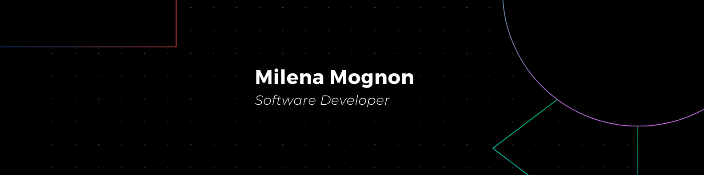

   Trabalhar com desenvolvimento é uma experiência incrível. A resolução de desafios e a constante busca por projetos inovadores são fontes de motivação para mim. Este entusiasmo me impulsiona a aprimorar minhas habilidades e a contribuir de forma significativa para o mundo da tecnologia. 

## My Skills

#### Stack Principal

&nbsp;
&nbsp;
&nbsp;
&nbsp;
&nbsp;
&nbsp;

#### Interesses e Estudos

&nbsp;
&nbsp;
&nbsp;
&nbsp;
&nbsp;

#### Banco de Dados

&nbsp;
&nbsp;

&nbsp;
&nbsp;
&nbsp;
&nbsp;
&nbsp;
&nbsp;

## Contacts:

